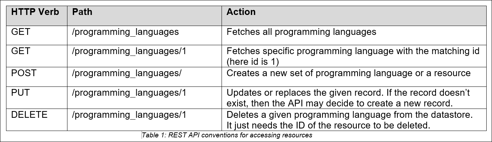
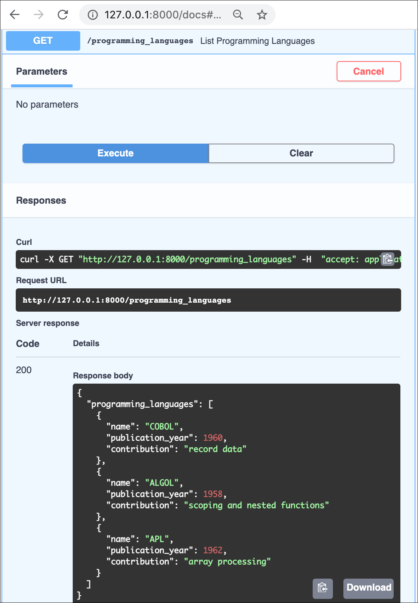
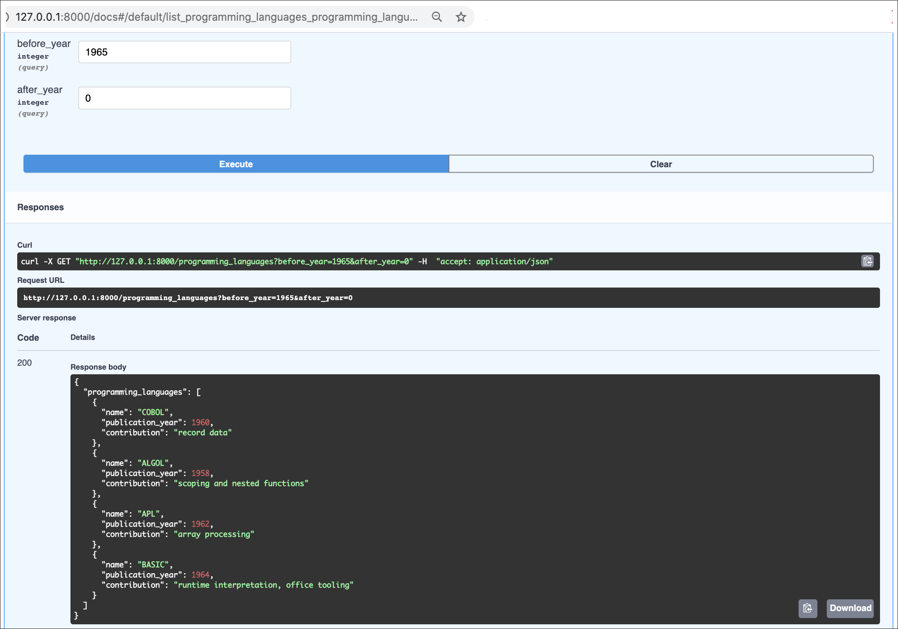

### Table of contents
   * [CRUD READ Operations in Python using FastAPI](#crud-read-operations-in-python-using-fastapi-view-list)
	   * [Introducing FastAPI](#introducing-fastapi)
	   * [FastAPI Features](#fastapi-features)
	   * [Install FastAPI](#install-fastapi)
   * [List Endpoint in FastAPI](#list-endpoint-in-fastapi)
   * [Detail Endpoint in FastAPI](#detail-endpoint-in-fastapi)
   * [Adding Filters to the List Endpoint](#adding-filters-to-the-list-endpoint)
   * [Conclusion](#conclusion)


# CRUD READ operations in Python Using FastAPI: View, List

The [last post](https://www.linode.com/docs/guides/development/python/choosing-python-api-framework) in this series compared four Python frameworks for writing an API: Django, Flask, FastAPI, and Bottle. Each framework has unique strengths, and the right choice depends on the use case.

## Introducing FastAPI

FastAPI is a modern Python **microframework** on the list that has the requisite functionality to support production applications.  This makes it a strong choice as a framework for a REST API.


## FastAPI Features

FastAPI gives you the following features:

- **Fast to code:** Allow developers to build up whatever structure of server they want, piece by piece. This means that an entire server could _live in one file_.
- **Short:** Provides the minimum toolset, and minimizes code duplication.
- **Automatic docs**: Provides interactive API documentation for decorated endpoints. It also boasts asynchronous operations. 
- **Easy:** FastAPIs are designed to be easy to use and learn.


## Install FastAPI

#### _Requirements_

Running a FastAPI server requires:
- Python 3.6+ 
- Dependencies for running the server - `gunicorn` or `hypercorn` package

#### _Install FastAPI_

```
pip install fastapi
pip install hypercorn
```

Now, in this tutorial, let us create a file called main.py, and build the following REST API endpoints. 

1.  **`List`** endpoint - that either gets all the records or filters them according to some criterion.
2. **`Detail`** endpoint - that fetches a specific record based on a unique identifier.

These endpoints allow the clients to perform the reading operations.

> **Why REST API?**
> The REST protocol is well-suited for servers that connect to a database and provide endpoints that allow client applications to perform database operations. Those operations have an acronym: **CRUD**, which stands for **C**reate, **R**ead, **U**pdate, **D**elete.


_NOTE: The data used in this demonstration is for educational and exploration purposes only ([courtesy of Hillel Wayne's research](https://www.hillelwayne.com/post/influential-dead-languages/))_.

By the end of this tutorial, you will understand how to use the `List` and `Detail` endpoints. This tutorial does not cover the details of integrating with a database.


## List Endpoint in FastAPI

**Step 1:**
Create a directory for the app to live in.
```
mkdir FastAPI_demo
```
**Step 2:**
Change the current directory to _FastAPI_demo_, and create a new file called `main.py` (file name can be anything).

```
cd FastAPI_demo
touch main.py
```
**Step 3:**
Import _FastAPI_ by inserting the following code at the top of the `main.py` file.
 
```
from fastapi import FastAPI
```
**Step 4:**
After importing the required library, instantiate the app. 
We can instantiate the class _FastAPI_ and assign it to a name (traditionally, `app`).

```python
app = FastAPI()
```

>FastAPI [allows integrations](https://fastapi.tiangolo.com/tutorial/sql-databases/) with a long list of different database providers and paradigms. 

**Step 5:**
Let's create a small in-memory data store in our app by instantiating a list. 

The list endpoint fetches _all_ of the data from this in-memory datastore.

```
in_memory_datastore = []
```

For this tutorial, let's add some starting data to the `in_memory_datastore` so that we have something to work with for the read endpoints.

```python
in_memory_datastore = [
  {"name": "COBOL", "publication_year": 1960, "contribution": "record data"},
  {"name": "ALGOL", "publication_year": 1958, "contribution": "scoping and nested functions"},
  {"name": "APL", "publication_year": 1962, "contribution": "array processing"},
]
```
Here, the `in_memory_datastore` has three attributes:
-- name of the programming language
-- the approximate year it was published
-- its conceptual contributions to the design of modern programming languages.

_NOTE: Each record within the `in_memory_datastore` is a Python dictionary_.

>RESTful APIs are generally organized around a _resource_—a name for the type of database records that it allows clients to access. 

The following table describes the different conventions used in RESTful APIs for accessing the resource.



**Step 6:**
Now, below the `in_memory_datastore`, write a rudimentary `List` endpoint that fetches all the records in the database and displays them to the client as a JSON object. This JSON object has the label `programming_languages`.

Here, the _resource_ is a _programming language_. Hence, the `List` endpoint has the name `/programming_languages` (all in lowercase).

Then, use the `get` HTTP verb without any parameters as shown below.

```python
@app.get('/programming_languages')
def get_programming_languages():
   return {"programming_languages" : in_memory_datastore }
```


> **⚠️Nota bene:**  
> There are two main reasons why the List was put into an object with a label, rather than returning the raw array.
> 
> **1. Maintainability:** 
>An object provides the freedom to add more attributes to the return body later.
> 
> For example, suppose we wanted to return a count of the objects in the database, we cannot add a _count_ attribute to a raw array, but we can add a _count_ attribute to an enclosing JSON object with one key that points to an array. 
> 
> This becomes _especially_ useful in APIs that allow clients to filter sections of data or to request aggregate metrics for the data or sections of data.
> 
> **2. Security:** 
> Ten years ago, browsers didn't guard against malicious actors redefining the JSON array and obtaining access to raw JSON array payloads. They have all patched it now, but the programming community kept on wrapping arrays in objects because of the maintainability benefit.

**Step 7:**
Start the app. 

On the command line, navigate to the directory where the app lives. Then run the following command:
```
hypercorn main:app --reload
```
- `hypercorn` invokes our server runner (or if you installed _gunicorn_ you might also use `gunicorn` instead). 
- `main` refers to the name of the `main.py` file.
- `app` refers to the name in our file that points to our instance of the FastAPI app. 
- `--reload` asks hypercorn to reload the app every time we change the `main.py` file.

>Press CTRL+C to quit the server.

**Step 8:**
Open your browser, and go to the following address:
```
http://127.0.0.1:8000/
```
##### Output:
You will see the `programming_languages` results in a JSON object containing the contents of the datastore.


Now, if you visit the endpoint http://127.0.0.1:8000/docs, you can see the interactive version of the API documentation where you can test the queries, and see their responses.



## Detail Endpoint in FastAPI

The next step is to create an endpoint to retrieve a _specific_ programming language from the datastore.

 The `Detail` endpoint has an interpolated variable in the endpoint string called `programming_language_id` that allows us to query for a specific item in our datastore. The _id_ in this example points to the index in the list that refers to the programming language. 

**Step 1:**

Add the below code underneath the code for listing the programming languages:

```python
@app.get('/programming_languages/{programming_language_id}')
def get_programming_language(programming_language_id: int):
   return in_memory_datastore[programming_language_id]
```
**Step 2:**
Run the app again.
A new entry is created on the `/docs` page.


Here, the `id` of `1` points to the second item in the ALGOL list. So requesting `programming_languages/1` fetches the ALGOL data.

## Adding Filters to the `List` Endpoint

Suppose we need to filter the programming language results for a certain period. 

For demonstration purpose, let's increase the size of the datastore to include a few more languages as shown below:

```python
in_memory_datastore = [
   {"name": "COBOL", "publication_year": 1960, "contribution": "record data"},
   {"name": "ALGOL", "publication_year": 1958, "contribution": "scoping and nested functions"},
   {"name": "APL", "publication_year": 1962, "contribution": "array processing"},
   {"name": "BASIC", "publication_year": 1964, "contribution": "runtime interpretation, office tooling"},
   {"name": "PL/1", "publication_year": 1966, "contribution": "constants, function overloading, pointers"},
   {"name": "SIMULA67", "publication_year": 1967, "contribution": "class/object split, subclassing, protected attributes"},
   {"name": "Pascal", "publication_year": 1970, "contribution": "modern unary, binary, and assignment operator syntax expectations"},
   {"name": "CLU", "publication_year": 1975, "contribution": "iterators, abstract data types, generics, checked exceptions"}
]
```
Let us allow clients to filter on the `publication_year` parameter. To do so, start treating programming languages as _objects_ rather than as _dictionaries_ at fetch time.

>- FastAPI provides an object mapper that allows us to define the attributes on a data type. 
>- FastAPI then attempts to automatically convert those objects to and from the input-output format, in this case, a _dictionary_. 

Let us demonstrate some of the utilities of Object-Relational Mapping (ORM).

1. To access the object mapper, import `BaseModel` from `pydantic` at the top of the file, just below the import line for FastAPI.
	```python
	from pydantic import Basemodel
	```
2. An appropriate base model for the programming language would include the attributes that the dictionary defines.
	```python
	class ProgrammingLanguage(BaseModel):
	   name: str
	   publication_year: int
	   contribution: str
	```
> - The base model supports a constructor that takes all the keyword arguments out of a dictionary. 
>- It also supports a `to_dict()` method for turning an object into a dictionary representation.

3. Modify the `list_programming_languages` method as shown below:

```python
@app.get('/programming_languages')
def list_programming_languages(before_year: int = 30000, after_year: int = 0):
   object_store = map(
       lambda pl_as_data: ProgrammingLanguage(**pl_as_data),
       in_memory_datastore
   )
   qualifying_data = list(
       filter(
          lambda pl: before_year > pl.publication_year > after_year,
           object_store
       )
   )
   return {"programming_languages" : qualifying_data }
```
4. Now, clients can filter the programming languages with two query parameters: `before_year` and `after_year`. 

>FastAPI automatically treats all parameters passed to a routed method, besides interpolated path parameters, as _query parameters_. If a client does not pass those, the default start year of 0, and our default end year of 30,000 automatically captures all languages. 
>
>**What is the benefit?** –No edge cases to check.
>**What would be the cost?** –If computers still exist in the year 30000, this app will break.

5. Upon receiving a request, this method converts all the items in the data store from dictionaries into `ProgrammingLanguage` objects. 

>This would make the request take a long time if the datastore had a lot of items in it—a problem worth reconsidering when we implement the write methods. In the meantime, this demonstrates some of the utility of the ORM.

6. The resulting objects then go through a filter that picks out only the ones with a `publication_year` between the `before_year` and the `after_year`. 

7. A request without these query parameters continues to deliver all of the programming languages:

	

8. While setting one or both of them limits the selection (in this case, the request limits the results to programming languages published before 1965):

	
	
## Conclusion

#### FastAPI gives us affordability for building RESTful read requests.

This tutorial has specifically discussed the two most common read requests for a RESTful endpoint–the `List` endpoint and the `Detail` endpoint. 

It also exemplified including query parameters in a request, for example, to filter the results from a `List` endpoint. 

The next tutorial about [implementing write requests](https://www.linode.com/docs/guides/development/python/write-requests-rest-fastapi) for the `programming_languages` API introduces additional concepts in building a FastAPI using REST API framework.

[Back to Page Top](#table-of-contents)
